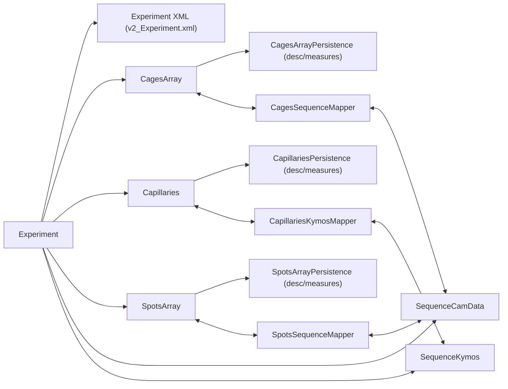

# Persistence API Refactor Plan for MultiCAFE

## Overview

Refactor the persistence surface of `Experiment`, `CagesArray`, `Capillaries`, `SpotsArray`, `SequenceCamData`, and `SequenceKymos` to have a small, consistent set of public methods (description / ROIs / measures), move cross-object data transfers into dedicated mapper helpers, and gradually retire confusing orchestration methods on `Experiment`.

## 1. Define and document a minimal persistence contract per domain object

- **Goal**: Make it obvious what can be loaded/saved for each core type and at what granularity.
- **Actions**:
- In `Experiment.java`, add Javadoc (and possibly a small internal interface description in comments) that defines for each object:
    - **Description**: identifiers, properties, and ROI geometry as stored in CSV/XML.
    - **ROIs**: ROIs materialized on `SequenceCamData` / `SequenceKymos` from description data.
    - **Measures**: time-series / kymograph-derived values, possibly parameterized by measure type.
- Align existing methods on persistence classes to this vocabulary, without changing behavior initially:
    - `CagesArrayPersistence`: treat `loadCagesArrayDescription` / `saveCagesArrayDescription` as **description**, `loadCagesArrayMeasures` / `saveCagesArrayMeasures` as **measures**.
    - `CapillariesPersistence`: treat `load_CapillariesArrayDescription` / `saveCapillariesArrayDescription` as **description**, `load_CapillariesArrayMeasures` / `save_CapillariesArrayMeasures` as **measures**.
    - `SpotsArrayPersistence`: treat `loadSpotsArrayDescription` / `saveSpotsArrayDescription` as **description**, `loadSpotsArrayMeasures` / `saveSpotsArrayMeasures` as **measures**.
- For `SequenceCamData` and `SequenceKymos`, document that **persistence** is currently:
    - Image files (JPEG/TIFF) on disk.
    - Timing and experiment-level metadata via `Experiment` XML.
    - ROIs serialized indirectly via capillary / cage / spot CSV/XML, not via a dedicated sequence persistence API.

## 2. Introduce explicit, well-named façade methods on Experiment

- **Goal**: Replace ad-hoc orchestration methods with a small set of clearly named entry points that delegate to per-object persistence.
- **Actions**:
- In `Experiment.java`, group and (if desired) rename existing methods into a small façade:
    - Experiment metadata: `xmlLoad_MCExperiment()` / `xmlSave_MCExperiment()` (already present) explicitly documented as **experiment description & timing**.
    - Cages: `loadCagesDescriptionAndMeasures()`, `saveCagesDescriptionAndMeasures()` as thin wrappers around `CagesArrayPersistence.loadCagesArrayDescription` + `loadCagesArrayMeasures` and `saveCagesArrayDescription` + `saveCagesArrayMeasures`.
    - Spots: `loadSpotsDescriptionAndMeasures()`, `saveSpotsDescriptionAndMeasures()` as wrappers around `SpotsArrayPersistence` methods.
    - Capillaries: `loadCapillariesDescriptionAndMeasures()`, `saveCapillariesDescriptionAndMeasures()` as wrappers around `CapillariesPersistence` methods.
- Keep existing methods like `load_MS96_cages`, `loadMCCapillaries`, `load_MS96_spotsMeasures` for backward compatibility, but:
    - Mark them as deprecated in Javadoc.
    - Internally implement them in terms of the new façade where possible so behavior remains unchanged.

## 3. Extract ROI/sequence transfer responsibilities into dedicated mapper helpers

- **Goal**: Make interactions between model objects (cages, spots, capillaries) and sequences (cam data / kymos) explicit and discoverable.
- **Actions**:
- Introduce small helper classes in `fmp_experiment` or `fmp_tools`, for example:
    - `CagesSequenceMapper` with methods like:
    - `pushCagesToCamSequenceROIs(CagesArray cages, SequenceCamData seqCamData)` (today: `cages.cagesToROIs`).
    - `pullCagesFromCamSequenceROIs(CagesArray cages, SequenceCamData seqCamData)` (today: `cages.updateCagesFromSequence`).
    - `pushCageSpotsToCamSequenceROIs(CagesArray cages, SpotsArray spots, SequenceCamData seqCamData)`.
    - `CapillariesKymosMapper` with methods like:
    - `pushCapillaryMeasuresToKymos(Capillaries caps, SequenceKymos seqKymos)` (today: `seqKymos.transferCapillariesMeasuresToKymos`).
    - `pullCapillaryMeasuresFromKymos(Capillaries caps, SequenceKymos seqKymos)` (today: `transferKymosRoisToCapillaries_Measures`).
    - `SpotsSequenceMapper` for spot ↔ sequence ROI conversions, mirroring existing calls in `Experiment`.
- In `Experiment`, replace direct calls like `cages.cagesToROIs(seqCamData)` and `seqKymos.transferKymosRoisToCapillaries_Measures(capillaries)` with calls to these mappers, shrinking orchestration logic.

## 4. Simplify or retire confusing orchestration methods on Experiment

- **Goal**: Make the `Experiment` API read like a clear script of high-level operations rather than mixing low-level details.
- **Actions**:
- Identify orchestration-style methods in `Experiment` (e.g. `load_MS96_cages`, `saveCagesAndMeasures`, `loadCamDataSpots`, `loadCamDataCapillaries`, `saveCapillariesMeasures`, `saveKymosCurvesToCapillariesMeasures`).
- For each, either:
- Re-implement as a 3–4 line method that:

1. Calls the appropriate façade persistence methods (from section 2).
2. Delegates transfers to mappers from section 3.
3. Returns a boolean or throws a clear exception.

    - Or, if no longer needed by callers, mark as deprecated and plan removal in a later cleanup step.
- Update the most important UI/service callers in `dlg/*` and `fmp_service/*` to use the new façade + mappers instead of the legacy orchestration names.

## 5. Optional: Granular measure loading

- **Goal**: Support cases where only some measure types are needed without overcomplicating the public API.
- **Actions**:
- In `CapillariesPersistence` and `SpotsArrayPersistence`, evaluate whether adding an overload like `loadMeasures(capillaries, dir, EnumCapillaryMeasures type)` or `loadMeasures(spotsArray, dir, EnumSpotMeasures type)` would simplify callers.
- If yes, implement these as thin filters over the existing `loadMeasures(...)` that read the CSV once and populate only the requested measure type.
- Keep the default `loadMeasures(...)` that loads all types as the main entry point to avoid API explosion.

## 6. Documentation and diagrams

- **Goal**: Capture the new mental model clearly so future changes stay consistent.
- **Actions**:
- Update `cursor/PERSISTENCE_REFACTORING_TESTING_PLAN.md` or a new markdown file under `cursor/` to describe the new layering.
- Add a mermaid diagram illustrating how persistence flows through the system after the refactor:

## 7. Testing and validation

- **Goal**: Ensure no change to persisted formats and that the UI/workflows still behave identically.
- **Actions**:
- Create a small set of test experiments (one per main workflow: cages-only, capillaries+kymos, spots) and record current behavior:
    - Files produced/loaded.
    - Number of cages/capillaries/spots.

