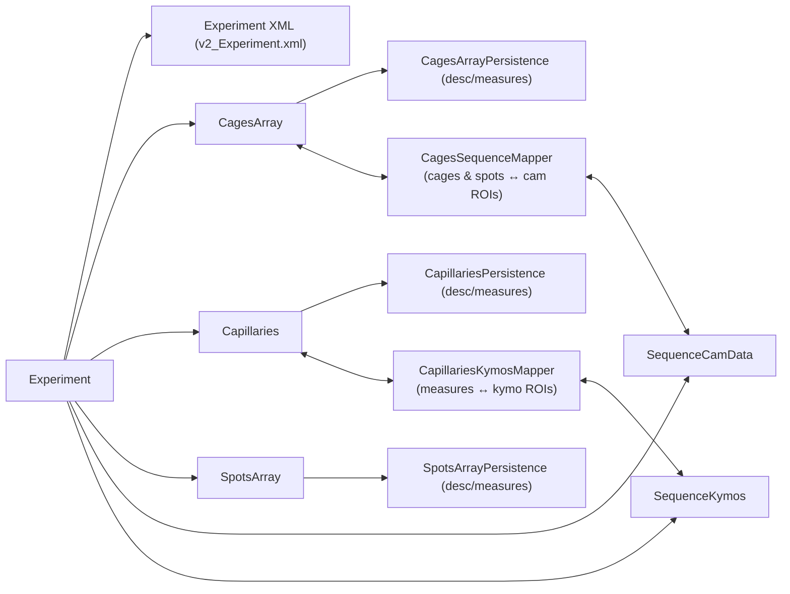

## Persistence API Summary — MultiCAFE

This document summarizes the current persistence responsibilities, recommended load/save entry points, and how to migrate from older orchestration methods to the clearer API.

---

## 1. Responsibilities by domain object

### 1.1 Experiment-level

| Object / concern | Description (what)                                  | Load                                  | Save                                  |
|------------------|-----------------------------------------------------|---------------------------------------|---------------------------------------|
| `Experiment`     | Experiment metadata + timing (XML)                  | `xmlLoad_MCExperiment()`              | `xmlSave_MCExperiment()`              |
| `Experiment`     | Directory layout (results / bin)                    | constructors, `setExperimentDirectory`| implied when you set directories      |

### 1.2 Cages, spots, capillaries

| Object           | Kind         | What’s persisted                        | Load (recommended)                           | Save (recommended)                            |
|------------------|-------------|-----------------------------------------|----------------------------------------------|-----------------------------------------------|
| `CagesArray`     | Description | cage layout + properties + cage ROIs    | `cages.getPersistence().loadCagesArrayDescription(...)` or via `Experiment.load_MS96_cages()` / `Experiment.loadCagesMeasures()` | `cages.getPersistence().saveCagesArrayDescription(...)` or `Experiment.save_MS96_cages()` / `Experiment.saveCagesMeasures()` |
| `CagesArray`     | Measures    | fly positions vs time                   | `cages.getPersistence().loadCagesArrayMeasures(...)` or `Experiment.load_MS96_cages()` / `Experiment.loadCagesMeasures()` | `cages.getPersistence().saveCagesArrayMeasures(...)` or `Experiment.saveCagesMeasures()` / `Experiment.save_MS96_cages()` |
| `SpotsArray`     | Description | all spots, geometry, descriptors        | `Experiment.load_MS96_spotsMeasures()` (internally `loadSpotsArrayDescription`) | `Experiment.save_MS96_spotsMeasures()` (internally `saveSpotsArrayDescription`) |
| `SpotsArray`     | Measures    | spot measures (e.g. area)               | `Experiment.load_MS96_spotsMeasures()` (internally `loadSpotsArrayMeasures`)    | `Experiment.save_MS96_spotsMeasures()` (internally `saveSpotsArrayMeasures`)    |
| `Capillaries`    | Description | capillary descriptors + ROI geometry    | `Experiment.loadCapillaries()` or `Experiment.loadMCCapillaries_Only()`         | `Experiment.saveCapillaries()`                |
| `Capillaries`    | Measures    | kymo-derived curves, gulps, etc.        | `Experiment.loadCapillaries()` or `Experiment.loadMCCapillaries()`              | `Experiment.saveCapillaries()` or `Experiment.saveCapillariesMeasures(String dir)` |

### 1.3 Sequences (images) and ROIs

| Concern                         | What                                    | API entry points (no format change)                   |
|---------------------------------|-----------------------------------------|-------------------------------------------------------|
| Camera images (`SequenceCamData`)| JPEG stack on disk                     | `SequenceCamData.initializeFromDirectory(...)` / builder + `loadImages()` |
| Kymos (`SequenceKymos`)        | TIFF stack on disk                      | `SequenceKymos.loadKymographs(...)` (service builds descriptor list) |
| Cages ↔ cam ROIs               | cage rectangles                         | `CagesSequenceMapper.pushCagesToSequence(...)` / `pullCagesFromSequence(...)` |
| Spots ↔ cam ROIs               | spot rectangles                         | `CagesSequenceMapper.pushSpotsToSequence(...)` / `pullSpotsFromSequence(...)` |
| Caps ↔ kymo ROIs               | level/gulp polylines                    | `CapillariesKymosMapper.pushCapillaryMeasuresToKymos(...)` / `pullCapillaryMeasuresFromKymos(...)` |

---

## 2. High-level persistence and ROI flow



This diagram is conceptual; concrete method names are in the tables above.

---

## 3. Deprecated orchestration methods and preferred replacements

This section gives a quick “old → new” view for the main orchestration-style methods on `Experiment` (and one on `SequenceKymos`).

### 3.1 Experiment XML

| Old method                    | Status / comment                                  | Preferred usage                            |
|------------------------------|---------------------------------------------------|-------------------------------------------|
| `load_MS96_experiment()`     | Obscure name; just loads experiment XML          | `xmlLoad_MCExperiment()`                  |
| `save_MS96_experiment()`     | Same as above                                     | `xmlSave_MCExperiment()`                  |

In code, mark the old methods:

```java
/** @deprecated Use {@link #xmlLoad_MCExperiment()} instead. */
@Deprecated
public boolean load_MS96_experiment() { ... }

/** @deprecated Use {@link #xmlSave_MCExperiment()} instead. */
@Deprecated
public boolean save_MS96_experiment() { ... }
```

### 3.2 Cages and spots

| Old / legacy usage                 | Issue today                                      | Recommended usage / mental model                                        |
|-----------------------------------|--------------------------------------------------|-------------------------------------------------------------------------| 
| `load_MS96_cages()`               | Does cages desc + measures + spots + ROIs       | Keep using; think “full cages+spots load + ROIs via `CagesSequenceMapper`” |
| `save_MS96_cages()`               | Saves desc+measures; implicitly syncs from ROIs | Keep using; now explicitly syncs via `CagesSequenceMapper.syncCagesFromSequenceBeforeSave` |
| `loadCagesMeasures()`             | Name hides ROI side effect                       | Use as “cages desc+measures + ROIs”; mapper handles ROI plumbing        |
| `saveCagesMeasures()`             | Name hides that description is also saved       | Use as “save cages desc (results) + measures (bin)”                     |
| `saveCagesAndMeasures()`         | Extra sync from sequence baked in               | Prefer `saveCagesMeasures()` plus explicit mapper call if needed; mark deprecated |
| `saveCagesArray_File()`          | Saves cages+spots, with hidden sync             | Only use where you want “sync cages from seq + save cages+spots”; consider deprecating |
| `saveSpotsArray_file()`          | Pulls spot ROIs from sequence then saves        | Use when spot ROIs changed; internally uses `CagesSequenceMapper.pullSpotsFromSequence` |

Suggested deprecation pattern:

```java
/**
 * Legacy alias that both synchronizes cages from sequence and saves
 * description + measures.
 *
 * @deprecated Prefer {@link #saveCagesMeasures()} and, when needed,
 * {@code CagesSequenceMapper.syncCagesFromSequenceBeforeSave(getCages(), getSeqCamData())}
 * for explicit control.
 */
@Deprecated
public void saveCagesAndMeasures() { ... }
```

### 3.3 Spots

| Old method                   | Status / comment                                | Preferred usage                                 |
|-----------------------------|--------------------------------------------------|------------------------------------------------|
| `load_MS96_spotsMeasures()` | Name only mentions measures, but also desc      | Keep using; interpret as “spots desc+measures” |
| `save_MS96_spotsMeasures()` | Same                                             | Keep using; interpret as “spots desc+measures” |

If there are any older `load_SpotsArray(...)` style methods, deprecate them in favor of `load_MS96_spotsMeasures()` or direct `SpotsArrayPersistence` calls.

### 3.4 Capillaries

| Old method                     | Status / comment                                | Preferred usage                                |
|--------------------------------|-------------------------------------------------|-----------------------------------------------|
| `loadMCCapillaries_Only()`     | Legacy, description only                        | Prefer `loadCapillaries()` when possible; use this only when you truly need desc-only |
| `loadMCCapillaries()`          | Legacy, description + measures                  | Prefer `loadCapillaries()`                    |
| `loadCapillaries()`            | Clear, generic                                  | Preferred generic loader for desc+measures    |
| `saveCapillaries()`            | Clear, generic                                  | Preferred generic saver for desc+measures     |
| `saveCapillariesMeasures(dir)` | Special “measures only” export, via kymos ROIs | Use when you want measures-only export        |

Recommended deprecation JavaDoc:

```java
/**
 * Legacy loader for capillary description only.
 *
 * @deprecated Use {@link #loadCapillaries()} for the common case,
 * or call CapillariesPersistence.load_CapillariesArrayDescription
 * directly when you explicitly want description only.
 */
@Deprecated
public boolean loadMCCapillaries_Only() { ... }
```

### 3.5 Sequence ↔ capillaries bridge

`SequenceKymos` currently exposes:

```java
public void saveKymosCurvesToCapillariesMeasures(Experiment exp) { ... }
```

If you want to steer new code toward the mapper:

```java
/**
 * Convenience method to pull capillary measures from kymograph ROIs
 * and save them via {@link Experiment#saveCapillaries()}.
 *
 * @deprecated Prefer using
 * {@link plugins.fmp.multicafe.fmp_experiment.capillaries.CapillariesKymosMapper#pullCapillaryMeasuresFromKymos}
 * followed by {@link Experiment#saveCapillaries()} directly.
 */
@Deprecated
public void saveKymosCurvesToCapillariesMeasures(Experiment exp) { ... }
```

---

## 4. Recommended replacement pattern (general recipe)

When you encounter an old orchestration-style method:

1. **Identify what it really does** in terms of:
   - description (experiment/cages/spots/caps),
   - measures,
   - ROIs ↔ sequence transfers.
2. **Rewrite or think of it** as:
   - one or more calls to the persistence layer (`*Persistence` or the “MS96” wrappers), plus
   - explicit calls to:
     - `CagesSequenceMapper.push*` / `pull*` (for camera ROIs), and/or
     - `CapillariesKymosMapper.push*` / `pull*` (for kymo ROIs).
3. **Mark the old method as `@Deprecated`** and in its JavaDoc:
   - briefly describe its behavior (“loads cages desc+measures and refreshes ROIs”), and
   - show 1–3 lines of preferred code, so callers know exactly how to migrate.

This way, existing callers continue to work, but the “green path” for future code is always the clearer, façade- and mapper-based API. 


